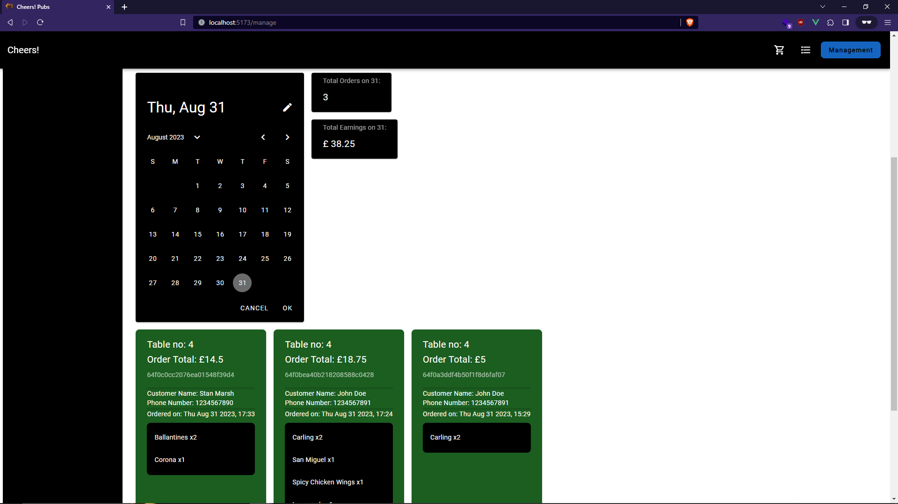

    

## 📑 Table of Contents

1. [Description](https://github.com/hirndev/CheersApp#-description)
2. [Purpose](https://github.com/hirndev/CheersApp#-purpose)
3. [Technologies](https://github.com/hirndev/CheersApp#-technologies)
4. [Features](https://github.com/hirndev/CheersApp#-features)
5. [Screenshots](https://github.com/hirndev/CheersApp#%EF%B8%8F-screenshots)
6. [Implementation](https://github.com/hirndev/CheersApp#%EF%B8%8F-implementation)
7. [Setup](https://github.com/hirndev/CheersApp#%EF%B8%8F-setup)
8. [ToDo](https://github.com/hirndev/CheersApp#-to-do)
9. [Attributions](https://github.com/hirndev/CheersApp#-attributions)
10. [License](https://github.com/hirndev/CheersApp#-license)

## 🌟 Description

Cheers!🍻
A fullstack WebApp for browsing and ordering from the Menu at a Pub. Users can place and view their orders and Admin can manage the Menu, process incoming Orders, view Order History, manage Users and Staff accounts. 

## 🌱 Purpose

An Open-source and online solution for local pubs.

## 🌐 Technologies

    
    
    

    
    
    
    
    

## 🧮 Features

- Browse the menu with an interactive UI.
- Add Items from menu to cart and place an order.
- View placed order status and order history.

  ### Admin

- View incoming orders; mark them as fulfilled or cancelled.
- View all past orders by date and chart for earnings for (x) number of days.
- View all users and their order history.
- Add Items to menu, delete items and mark as out-of-stock.
- Add/Delete staff accounts.

<!-- ## Video -->

<!-- video embed -->

## 🖥️ Screenshots

## Users

- ### Homepage

  
  
  

- ### Auth

  
  
  

- ### Menu

  
  
  

- ### Menu Out-of-Stock

  

- ### Orders

  
  
  

- ### UI Dialogs

  
  
  

- ### Others

  
  

## Admin Dashboard

- ### Admin Auth

  
  

- ### Admin Orders

  Pending Orders  

  

  Completed Orders  

  
  

  Cancelled Orders  

  

- ### Menu Manage

  Menu  

  

  Add to menu  

  

  Deleted Menu  

  

- ### Accounts

  User Accounts  

  

  Staff Accounts  

  

  Delete staff account  

  

  Add staff account  

  

## ⚗️ Implementation

- 📡 Axios for API calls.
- 📈 ChartJS for plotting data on charts.
- 🔐 Authentication & Authorization with Passport in backend.
- 🛡️ Common Security safeguards

  ### Frontend

  - 🧼 Vee-Validate

  ### Backend

  - 👮 Joi Validations
  - ⛑️ Helmet
  - 🧼 SanitizeHTML
  - 🧼 ExpressMongoSanitize

<!-- ## 🔧 Structure -->

<!-- ADD STRUCTURE DIAGRAM  -->

## 🛠️ Setup

1. Install MongoDB.
2. Install NodeJS.
3. Run mongod.
4. In your terminal run command `npm install` from root and frontend folder, to install all the dependencies.
5. To start the server run `npm run server` from root. @ localhost:3000.
6. To start the client run to `npm run client` from root. @ localhost:5173.
7. In your browser head to `localhost:5173`.

## 🎯 To-do

- Write unit tests with vitest.
- Improve category & sub-category. Make it more dynamic.
- Add search functionality to menu.
- Edit menu items with help of vee-validate.

## 📣 Attributions

- Vuetify for building UI.
- A classic American sitcom; Cheers for the logo and example branding.
- BingAI for images.

## 📋 License

This project is licensed under the MIT License.
